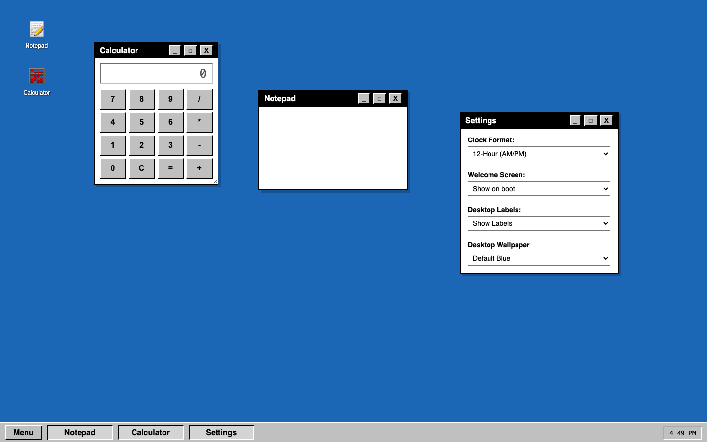
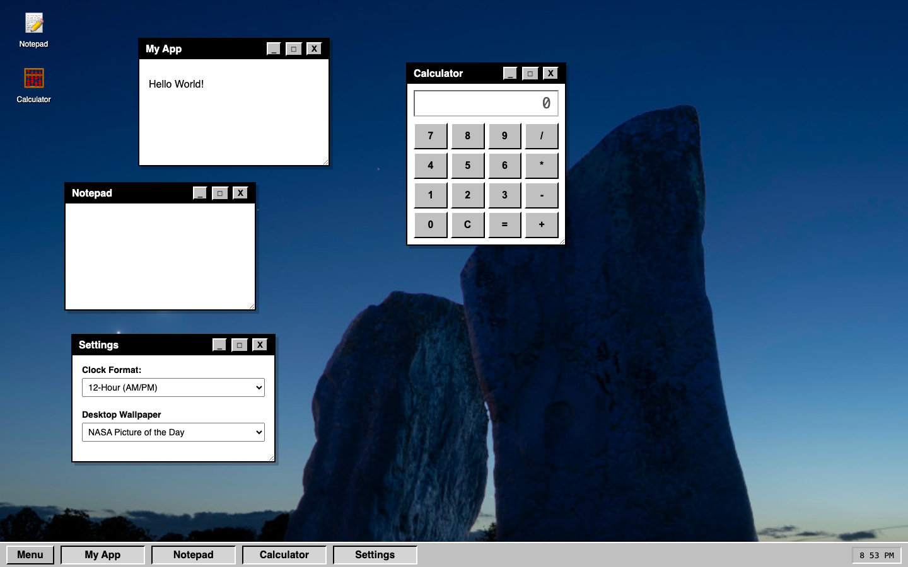
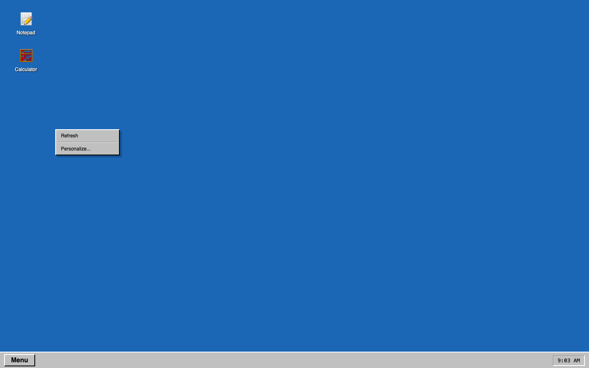

# WebOS 1.0

A fully interactive Operating System environment built directly in the browser.

### 🌐 Live Demo
**https://my-web-os-inky.vercel.app/**

### 📸 Preview

### 🚀 How to Run Locally
Because this project uses pure HTML, CSS, and JS with zero additional libraries and dependencies, running it locally is instant:
1. Clone or download this repository to your machine.
2. Open the folder.
3. Double-click `index.html` to open it in any modern web browser. No terminal commands required.

### 🛠 Technical Highlights
* **Various Personalization Options:** You can either stay with the default blue wallpaper, or you can enter a custom URL to personalize the wallpaper to whatever you want. Moreover, if you like Space, you can choose the NASA Picture of the Day option which fetches the real-time NASA Astronomy Picture of the Day using the NASA API and sets it as the wallpaper. Other personalization possiblities include Time-Formats (12-hour and 24-hour), Desktop Labels, and more.

**NASA Picture of the Day:**

* **Custom Window Manager:** A simple  drag-and-drop system that uses Z-Index to work. You can drag it wherever you want and it will stay there. Minimizing and maximizing of the windows is also implemented.

* **State Persistence:** The browser `localStorage` is used to permanently save the X/Y coordinates of desktop icons (aswell as some other settings) so the stay in the same place even after refreshing the website.

* **Custom Context Menu:** Disabled the browser's native context menu and implemented a custom OS-level right-click menu, making the environment more unique.
**Context menu:**

* **Apps:** v1 comes with some apps already installed, namely the calculator and notepad app, giving you the basic funtionality.